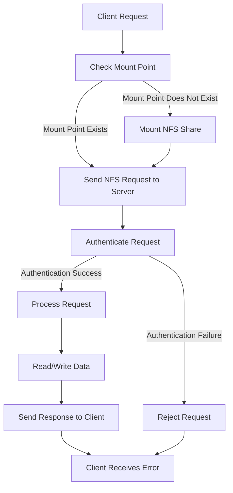

# NFS Server Setup on Red Hat Enterprise Linux (RHEL)

## Objective

The objective of this project is to set up an NFS (Network File System) server on Red Hat Enterprise Linux 
(RHEL) to provide shared file access to multiple client machines. This setup ensures that files can be 
centrally managed and accessed from different systems within the network.

## Project Overview

1.  **Planning and Preparation**
    
    -   Define requirements and objectives.
    -   Prepare the RHEL environment.
    -   Install and configure necessary packages.
2.  **NFS Server Installation**
    
    -   Install NFS server on the designated server node.
    -   Configure NFS exports and permissions.
3.  **NFS Client Configuration**
    
    -   Install and configure NFS client software on client nodes.
    -   Mount the NFS shares on client machines.
4.  **Testing and Validation**
    
    -   Test file access from client machines.
    -   Validate permissions and access controls.
5.  **Documentation and Conclusion**
    
    -   Document the setup process.
    -   Evaluate benefits, challenges, and performance.

## Step-by-Step Configuration

### 1. Planning and Preparation

-   **Install RHEL**: Ensure RHEL is installed and updated on the server and client nodes.
-   **Update System**:

    `sudo yum update -y` 
    

### 2. NFS Server Installation

#### On the NFS Server Node (e.g., `nfs-server`)

-   **Install NFS Server Package**:
    
    `sudo yum install nfs-utils -y` 
    
-   **Start and Enable NFS Services**:

    
    `sudo systemctl start nfs-server
   sudo systemctl enable nfs-server` 
    
-   **Create a Directory to Share**:
    
    `sudo mkdir -p /mnt/nfs_share` 
    
-   **Set Directory Permissions**:
    
    
    `sudo chmod 755 /mnt/nfs_share` 
    
-   **Configure NFS Exports**:
    -   Edit `/etc/exports` and add:

        
        `/mnt/nfs_share *(rw,sync,no_root_squash,no_subtree_check)` 
        
-   **Export the Shares**:
    
    
    `sudo exportfs -r` 
    
-   **Configure Firewall**:

    
    `sudo firewall-cmd --permanent --add-service=nfs
    sudo firewall-cmd --permanent --add-service=mountd
    sudo firewall-cmd --permanent --add-service=rpc-bind
    sudo firewall-cmd --reload` 
    

### 3. NFS Client Configuration

#### On the NFS Client Nodes (e.g., `client01`, `client02`)

-   **Install NFS Client Package**:
    
    `sudo yum install nfs-utils -y` 
    
-   **Create a Mount Point**:
    
    `sudo mkdir -p /mnt/nfs_mount` 
    
-   **Mount the NFS Share**:

    
    `sudo mount -t nfs <nfs_server_ip>:/mnt/nfs_share /mnt/nfs_mount` 
    
-   **Verify the Mount**:
    
    
    `df -h /mnt/nfs_mount` 
    
-   **Configure Persistent Mount**:
    -   Edit `/etc/fstab` and add:

        
        `<nfs_server_ip>:/mnt/nfs_share /mnt/nfs_mount nfs defaults 0 0` 
        

### 4. Testing and Validation

-   **Test File Access**:
    -   Create a test file on the NFS server:

        
        `sudo touch /mnt/nfs_share/test_file` 
        
    -   Verify that the file is accessible from the client machines:

        
        `ls /mnt/nfs_mount/` 
        
-   **Validate Permissions**:
    -   Check that permissions and ownership are correctly applied to files and directories.

### 5. Documentation and Conclusion

-   **Document Configuration**: Record all installation and configuration steps, including any custom 
settings.
-   **Evaluate Benefits**:
    -   **Centralized File Access**: Provides a single point for managing files.
    -   **Scalability**: Easily extendable to additional clients.
-   **Challenges**:
    -   **Security**: Ensure proper access controls and permissions to protect shared files.
    -   **Performance**: Monitor and optimize performance as needed.
